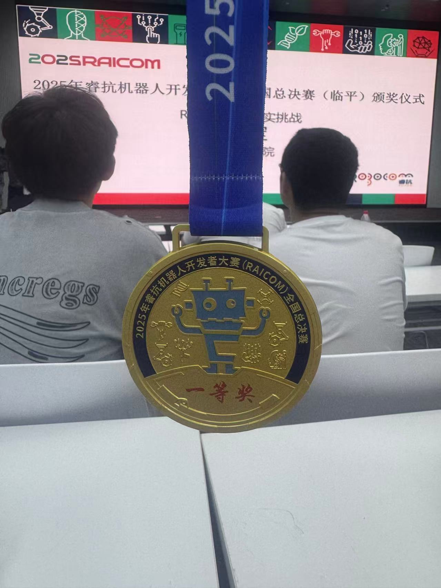

# 仓库说明

## 📖 项目概述
本项目是为 **RAICOM 睿抗 ROS 虚实挑战赛（轮式）** 设计的 ROS 工作空间，整合了参加全国总决赛所需的核心算法与功能包。

## 🏆 赛事成绩
在 RAICOM ROS 虚实挑战赛（轮式）中，本项目方案荣获 **全国一等奖**。

  

  

> **一些碎碎念：**
> 本次比赛最后取得了全国一等奖的成绩，实际上运气是有点差的，我们比赛的时候没有轮空导致和对方车辆很多次的碰撞。如果正式比赛同比我们快的队伍一样轮空，单独跑，是不是就能国冠了？但比赛大多都有遗憾吧，希望以后的学弟学妹们能再拿回来我们的国冠。在此特别鸣谢邢巍川学长，我们的算法是基于他的纯FGM算法进行改进优化的，也算是弥补了去年他参赛时因设备过热重启的遗憾。

## 🎥演示视频

### 🏁全国预选赛

### 🏆全国总决赛

## 🚀 核心算法
本项目的核心策略是 **Follow-the-Gap (FTG) 算法与传统导航相结合**。理想方案旨在利用 FTG 算法在直道上实现高速行驶，并在弯道等复杂路段切换至导航模式（Move Base + TEB）以保证稳定过弯。

比赛中，由于准备时间仓促及现场调试限制，导航模块未能达到理想效果。具体表现为 `move_base` 未能及时反馈导航成功状态，导致无法自动切换回高速 FTG 模式。因此，我们采取了临时策略：将导航超时时间缩短至 0.2 秒，使其仅在弯道前起到减速作用，以弥补 FTG 算法前瞻性不足的缺陷，防止因速度过快而冲出赛道。

## 🤔 开发回顾与思考
这次比赛准备得比较仓促，我的精力有90%都放在了另一个比赛上，导致这个项目只在赛前两天完成了算法移植，甚至没有搭建过一次完整的场地进行测试。考虑到省赛和国赛总共准备时间不到两周，这个成绩也算是不错了。

我们遇到的主要技术挑战是 `TEB` 参数过于繁多，在短时间内很难调试到理想状态，而且比赛地图也可能临时修改，这让纯导航方案的下限很低，上限又很难达到。理想的 FTG+NAV 方案需要精确的定位和优化的 TEB 参数。我们本想用 Cartographer 进行建图和定位，但因为启动时一直报错，最终只能选择 GMapping，并通过后期修图来弥补建图效果的不足。

## 🔧 工作区结构
本工作区主要包含以下几个关键部分：

### 1. `f1` (核心算法与控制包)
`f1` 包是为本次比赛自主开发的核心功能包，实现了主要的路径规划与导航逻辑。
*   **`scripts/`**
    *   `ftg.py`: **Follow-the-Gap 算法节点**。处理激光雷达数据，寻找最大空隙以引导赛车高速避障。
    *   `nav_manager.py`: **导航管理节点**。作为一个状态机，负责在 FTG 和导航模式之间进行决策与切换。
*   **`launch/`**
    *   `all.launch`: **比赛核心启动文件**。一键启动所有必需的算法节点和底层驱动。
*   **`cfg/`**
    *   存放 `rqt_reconfigure` 的动态调参配置文件，便于现场实时优化 `ftg` 等算法参数。

### 2. `tianracer` (小车基础环境包)
比赛官方提供的小车底层驱动与基础功能包。

### 3. `lby_test` (基础环境启动包)
该包从 `tianracer` 中抽离了核心的启动文件，简化了基础环境的启动流程，提高了开发与调试效率。

### 4. `demo` (演示文件夹)
存放比赛的最终演示视频与相关资料。

## 🌿 分支说明

- **`main` (主分支)**: **推荐查看**。此分支是基于 `final` 分支整理优化后的代码，结构更清晰，是项目当前最稳定的版本。

- **`final` (比赛分支)**: 比赛时实际使用的版本。最终采用的方案是 **FTG + 导航（0.2s 超时切换）**。

- **`test/*` (测试分支)**: 存放开发过程中的各种实验性方案：
  - `test/ftg_nav`: “FTG + 导航” 方案
  - `test/ftg_go`: “FTG + TEB 区域直行” 方案
  - `test/ftg`: “纯 FTG” 方案

## 💡 未来展望与改进建议
为了进一步提升性能，总结出以下几点可行的改进方向：

1.  **建图与定位优化**: 推荐使用 `Cartographer` 替代 `GMapping`。`Cartographer` 在建图闭环和纯定位方面表现更优（“不如他的一根”），能够为导航提供更精确的位姿。同时，需要搭建一个足够大的场地来充分测试 FTG 与 NAV 模式的切换流畅度。
2.  **局部路径规划器优化**: 不建议完全依赖 `TEB`。可以尝试针对比赛场景开发专用的局部规划器。自研规划器参数更少，针对性更强，调试起来会更方便。
3.  **融合全局路径的反应式规划**: 一种更具潜力的方案是，在 `move_base` 规划出全局路径后，结合反应式避障算法（如 FTG）进行局部路径决策。这种方法可以融合全局路径的前瞻性和反应式算法的灵活性，但需要进一步的研究与探索。

